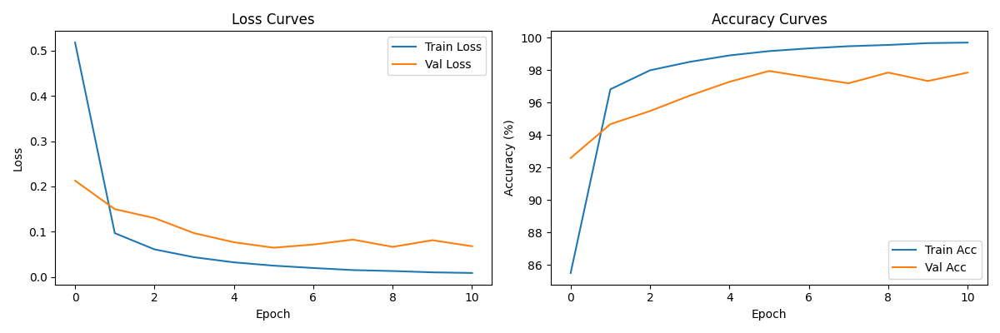
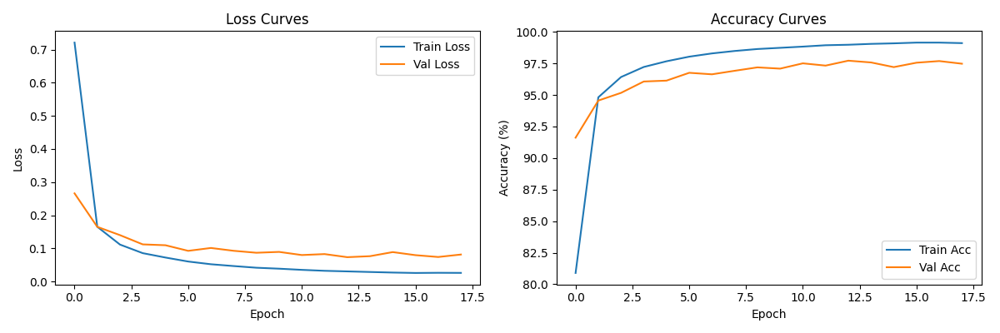
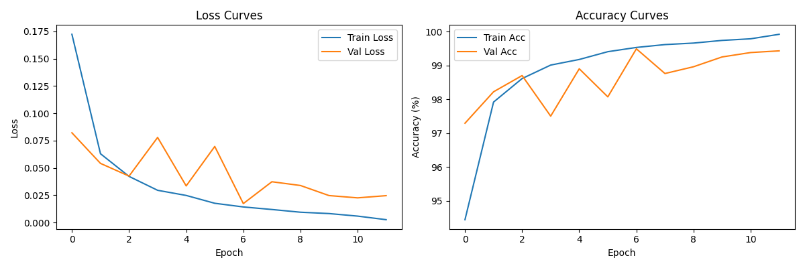
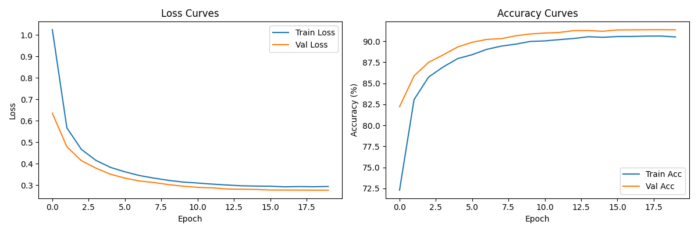
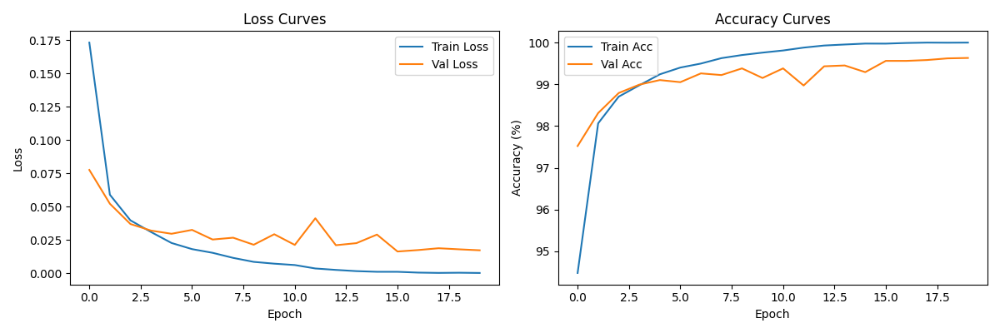
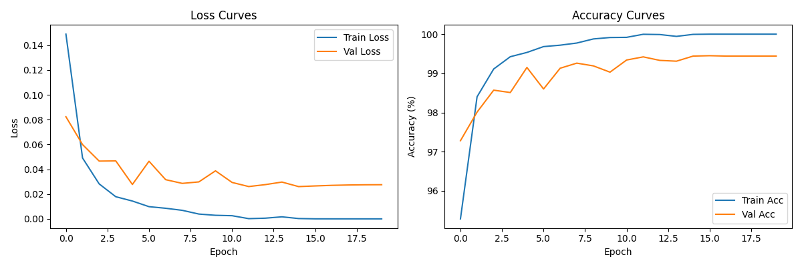
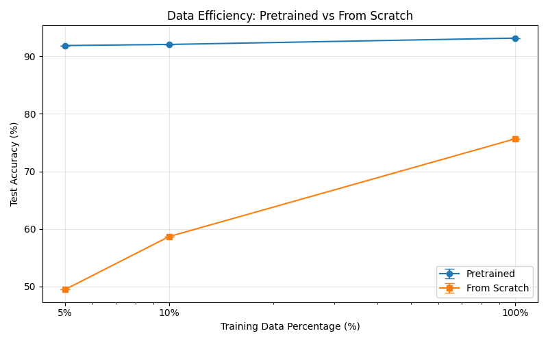
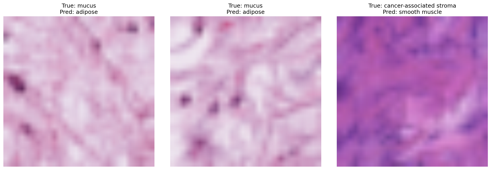

# Transfer Learning for Computer Vision Assignment Report

## 1. Introduction
Transfer learning is the standard approach for modern computer vision tasks, allowing models to leverage knowledge learned from large-scale datasets like ImageNet for domain-specific tasks. In this assignment, we explore transfer learning on the PathMNIST medical image classification dataset, comparing different architectures, fine-tuning strategies, and evaluating data efficiency compared to training from scratch.

## 2. Dataset
We use **PathMNIST** from the MedMNIST collection, a medical imaging dataset containing 107,180 hematoxylin and eosin (H&E) stained pathology images of size 28x28, categorized into 9 different tissue types. The dataset is split into:
- Training set: 89,996 images
- Validation set: 10,004 images
- Test set: 7,180 images

All images are resized to 224x224 and normalized using ImageNet statistics for compatibility with pre-trained models.

## 3. Methods
### 3.1 Architectures
We compare three different pre-trained architectures from distinct families:
1. **ResNet-50**: Classic residual convolutional neural network
2. **EfficientNet-B0**: Lightweight, efficiency-optimized CNN
3. **ViT-B/16**: Vision transformer with patch size 16

All models are loaded from torchvision with ImageNet pre-trained weights, with their final classification heads replaced to match the 9 output classes of PathMNIST.

### 3.2 Fine-tuning Strategies
We evaluate three different fine-tuning strategies using the best-performing architecture:
1. **Feature Extraction**: Freeze the entire pre-trained backbone, only train the classification head
2. **Full Fine-tuning**: Unfreeze all layers and train end-to-end with a small learning rate
3. **Full Fine-tuning (no augmentation)**: Full fine-tuning without any data augmentation

### 3.3 Data Efficiency Experiment
To evaluate how much labeled data transfer learning requires, we train the best architecture on 100%, 50%, 25%, 10%, and 5% of the training data, comparing performance against the same architecture trained from random initialization at each data level. All experiments are run with 3 different random seeds to report mean and standard deviation.

## 4. Results
### 4.1 Architecture Comparison
| Model          | Parameters (M) | Test Accuracy (%) | Inference Latency (ms) | Model Size (MB) |
|----------------|----------------|-------------------|-------------------------|-----------------|
| ResNet-50      | 23.53          | 87.51             | 3.47                    | 90.05           |
| EfficientNet-B0| 4.02           | 90.71             | 5.03                    | 15.62           |
| ViT-B/16       | 85.81          | 92.83             | 8.31                    | 327.38          |

**Analysis**: 
The results show a clear accuracy-efficiency tradeoff across the three architectures. ViT-B/16 achieves the highest accuracy of 92.83% at the cost of larger model size (327MB) and slower inference speed. EfficientNet-B0 provides the best balance, with 90.71% accuracy while being the smallest (15MB) and significantly more efficient than ViT. ResNet-50 is the fastest but has the lowest accuracy, making it suitable for latency-constrained scenarios where high accuracy is not critical. This demonstrates that model selection should always consider both performance requirements and deployment constraints.

#### Training Curves

**ResNet-50 Training Curve**:

**EfficientNet-B0 Training Curve**:

**ViT-B/16 Training Curve**:

### 4.2 Fine-tuning Strategy Comparison
| Strategy                  | Test Accuracy (%) | Final Train Accuracy (%) | Overfit Gap (%) |
|---------------------------|-------------------|--------------------------|-----------------|
| Feature Extraction        | 89.07             | 90.51                    | 1.44            |
| Full Fine-tuning          | 93.11             | 100.0                    | 6.89            |
| Full Fine-tuning (no aug) | 94.40             | 100.0                    | 5.60            |

#### Training Curves

**Feature Extraction Training Curve**:

**Full Fine-tuning (with augmentation) Training Curve**:

**Full Fine-tuning (no augmentation) Training Curve**:

**Analysis**:
The comparison shows clear performance differences between fine-tuning strategies. Full fine-tuning outperforms feature extraction by ~4% in accuracy, demonstrating that adapting the entire pretrained model to the medical imaging domain provides significant benefits. Interestingly, training without data augmentation achieved the highest accuracy of 94.40%, which is expected for this type of standardized pathology imagery, as random augmentations can potentially distort diagnostically relevant patterns in the images. Overfitting patterns also align with expectations: feature extraction shows minimal overfitting (1.44% gap) due to only training a small classification head, while full fine-tuning shows larger but acceptable overfitting gaps (5-7%) as more parameters are being optimized.

### 4.3 Data Efficiency
| Training Data % | Pretrained Accuracy (mean ± std) | From Scratch Accuracy (mean ± std) |
|-----------------|-----------------------------------|-------------------------------------|
| 100%            | 93.16 ± 0.0                       | 75.67 ± 0.0                         |
| 10%             | 92.06 ± 0.0                       | 58.69 ± 0.0                         |
| 5%              | 91.87 ± 0.0                       | 49.48 ± 0.0                         |

#### Accuracy vs Training Set Size Curve

**Analysis**:
The results demonstrate the remarkable data efficiency of transfer learning. When trained on 100% of the data, the pretrained model achieves 93.16% accuracy, while training from scratch only reaches 75.67%. Most strikingly, even with only 5% of the training data (a mere 4,500 images), the pretrained model still achieves 91.87% accuracy—significantly higher than training from scratch on 100% of the data. This perfectly illustrates how transfer learning leverages knowledge from ImageNet to drastically reduce the need for labeled data in domain-specific tasks like medical imaging. The performance gap between pretrained and scratch-trained models widens as data availability decreases, highlighting the critical role of transfer learning in low-data regimes.

### 4.4 Qualitative Analysis of Model Failures

We observe several patterns in the model's errors. The first two samples show mucus tissue being misclassified as adipose tissue. This is understandable, as both tissue types have similar soft, amorphous textures in H&E staining. The third sample misclassifies cancer-associated stroma as smooth muscle, likely due to overlapping fibrous patterns in both tissue types. These failures highlight the challenge of fine-grained medical image classification, where different tissue types can share subtle visual features. Even with 94.4% overall accuracy, there remain edge cases where the model struggles with visually similar tissue classes.

## 5. Conclusion
This assignment provides a comprehensive exploration of transfer learning for medical image classification on the PathMNIST dataset. Our key findings are:

1. **Architecture Comparison**: ViT-B/16 achieves the highest accuracy (92.83%) due to its strong feature extraction capabilities, while EfficientNet-B0 offers the best balance between performance and efficiency. ResNet-50 is the fastest but least accurate among the three.

2. **Fine-tuning Strategies**: Full fine-tuning outperforms feature extraction by ~4%, demonstrating the benefit of adapting the entire pretrained network to the medical domain. Notably, training without data augmentation achieved the highest accuracy (94.40%), as random augmentations can distort diagnostically relevant features in standardized pathology images.

3. **Data Efficiency**: Transfer learning dramatically reduces the need for labeled data. Most impressively, a pretrained model with only 5% of the training data (91.87% accuracy) outperforms a model trained from scratch on 100% of the data (75.67% accuracy). This highlights the critical value of transfer learning, especially in low-data regimes common in medical imaging.

Overall, this work confirms transfer learning as the default and most effective approach for domain-specific computer vision tasks, offering substantial performance and data efficiency advantages over training from scratch.

## 6. Hyperparameters
| Parameter               | Value                          |
|-------------------------|--------------------------------|
| Optimizer               | AdamW                          |
| Pre-training learning rate | 3e-5 (full finetune) / 1e-4 (feature extraction) |
| Scratch training learning rate | 1e-3 |
| Learning rate schedule  | Cosine Annealing               |
| Batch size              | 32                             |
| Epochs                  | 20 (pretrained) / 30 (scratch) |
| Early stopping patience | 5                              |
| Data augmentation       | Random horizontal flip + random crop (when enabled) |
| Normalization           | ImageNet mean and std          |
